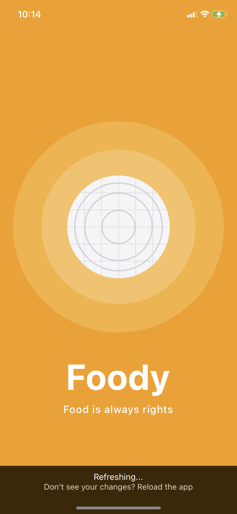
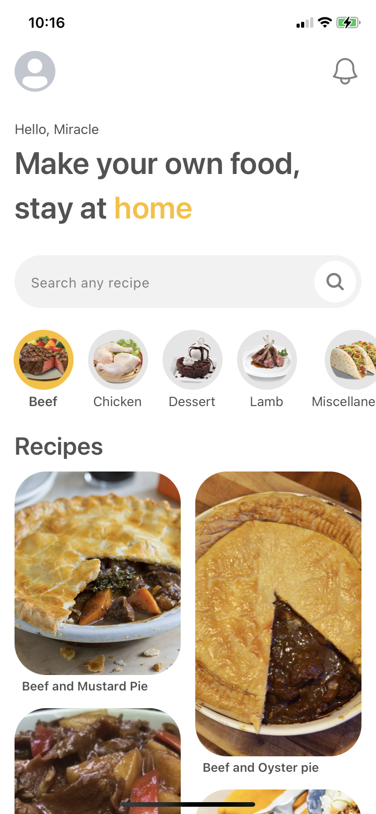
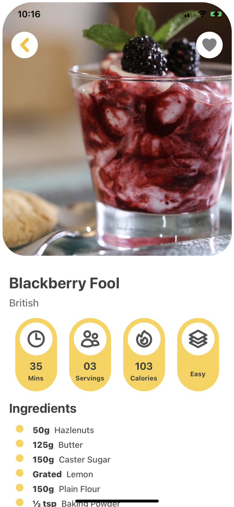
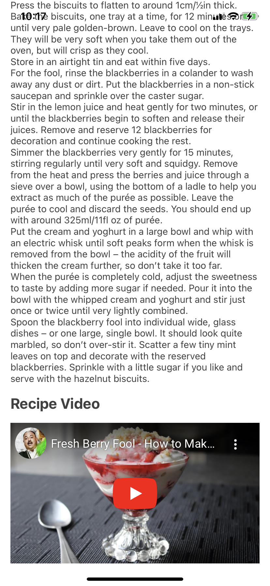
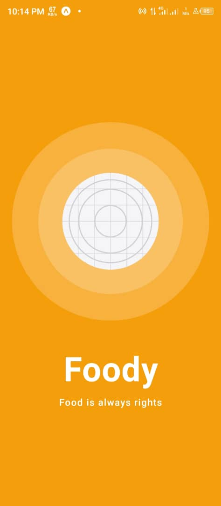
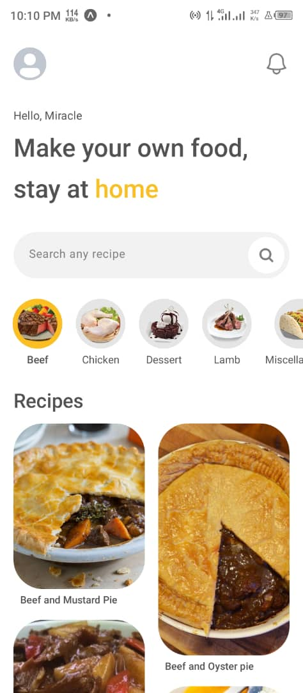
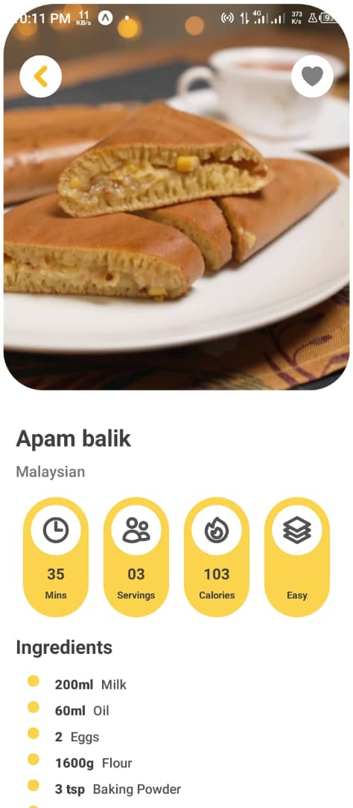
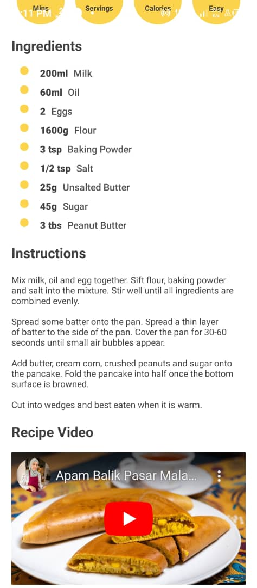

# Food Recipe App
This app help end user to quickly browse through the recipe neeeded to cook their favourite meals

## Dependencies for project
- reactnavigation
- react-native-heroicons
- react-native-responsive-screen
- nativewind

  This amongst others were needed in the development of this app

## ScreenShots of App
- IPhone XR View of the App
<p align="center">




</p>

- Andriod View of the App
<p align="center">


  
  
  
</p>

## How to Run Project
-  first you will need to have npm installed in your laptop
- clone this project with the command `git clone https://github.com/m4-programmer/FoodRecipeApp.git`
- cd to the project `cd FoodRecipeApp`
- run `npm install` to install the needed dependencies
- run `expo start`, or `npm start` or
- run npm i -g ```expo-cli``` and then run `expo-cli run --tunnel` or `npx expo-cli run --tunnel`
- on your andriod or iphone install expo app
- test the app and leave me a thumbs up
